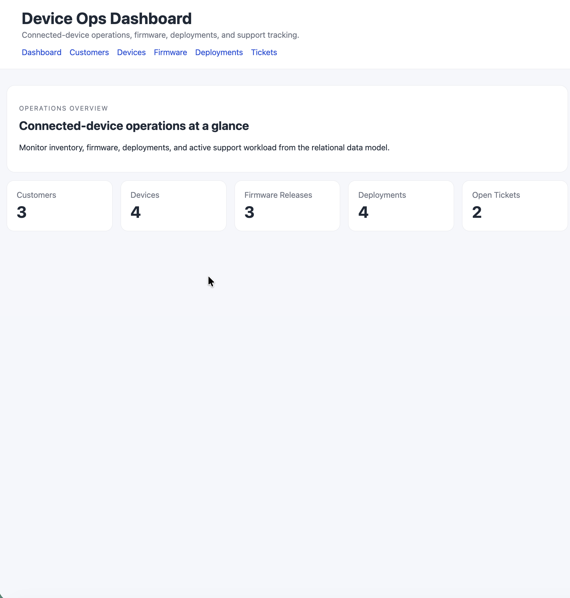
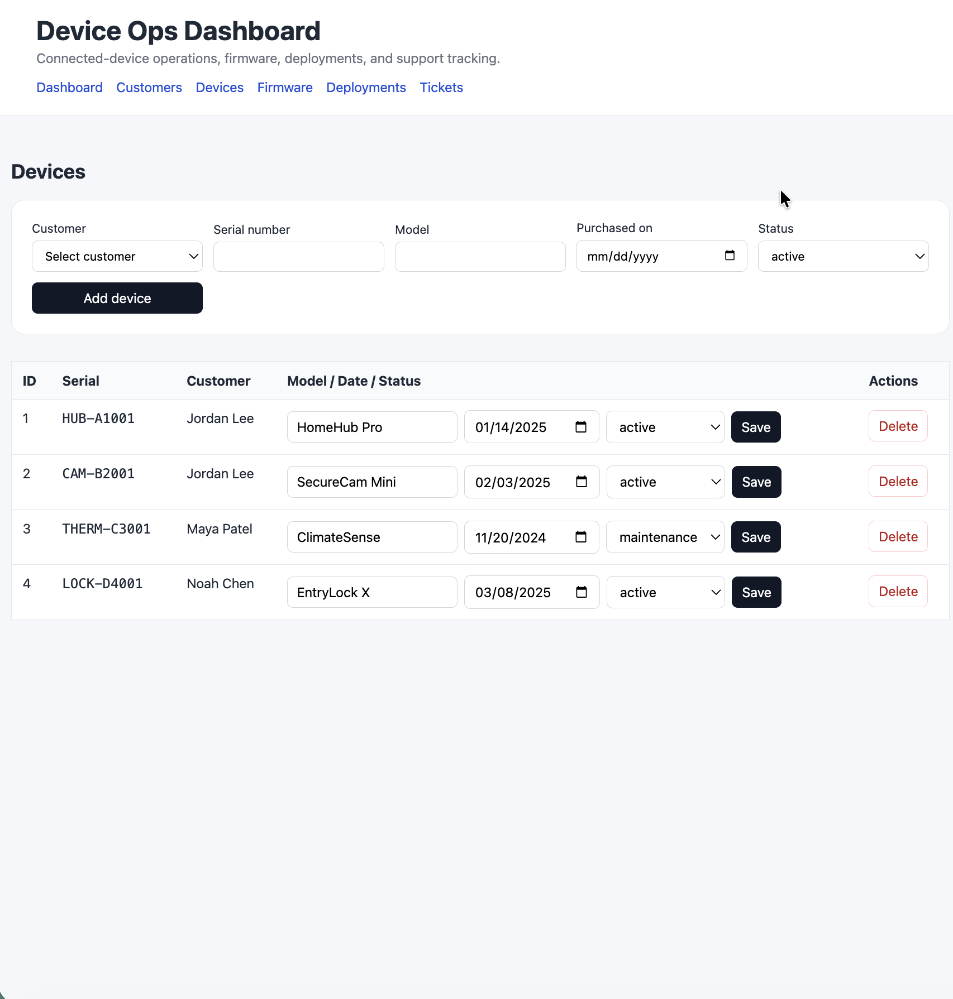
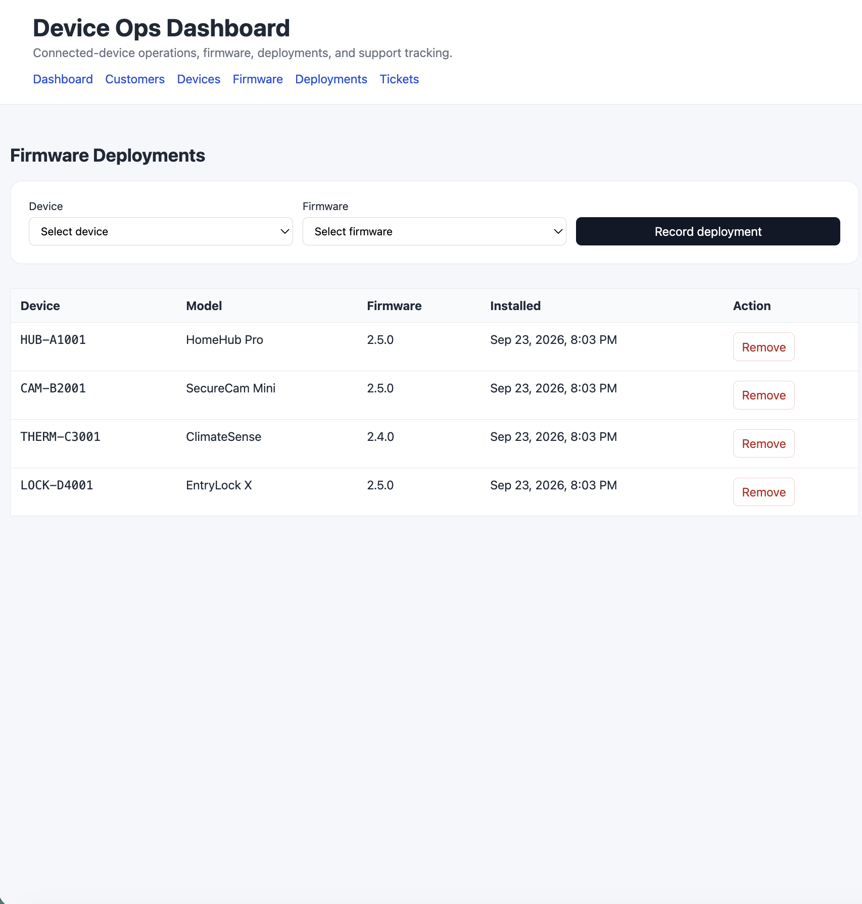

# Device Ops Dashboard

A full-stack portfolio project for managing connected devices, firmware releases, customer ownership, deployment relationships, and service tickets.

## Application Preview

### Operations Dashboard



### Device Management



### Firmware Deployments



## Why this project exists

Device Ops Dashboard is an independent rebuild of database and full-stack concepts I originally practiced in coursework. It is not a republished assignment solution. The data model, project structure, implementation, validation, seed data, and documentation were rebuilt for portfolio use.

The goal is to demonstrate practical skills in:

- relational database design;
- CRUD-oriented backend development;
- parameterized SQL;
- server-side rendering;
- input validation;
- modular Express routing;
- many-to-many relationships;
- foreign-key behavior;
- testable utility code;
- database-backed HTTP integration testing.

## Stack

- Node.js
- Express
- Handlebars
- MySQL / MariaDB-compatible SQL
- `mysql2/promise`
- Node's built-in test runner
- HTML / CSS

## Domain Model

The application models a small connected-device operations platform.

### Customers

Customer records represent device owners.

### Devices

Each device belongs to a customer and tracks:

- serial number;
- model;
- purchase date;
- lifecycle status.

### Firmware Releases

Firmware records track version, release date, package size, and release status.

### Device ↔ Firmware Deployments

A junction table models the many-to-many relationship between devices and firmware releases.

### Service Tickets

Support tickets connect customers to optional device records and track issue summaries and workflow status.

## Relational Design

```text
customers
   |
   | 1:M
   v
devices --------< device_firmware >-------- firmware_releases
   |
   | 1:M
   v
service_tickets

customers 1:M service_tickets
```

The schema demonstrates primary keys, unique constraints, foreign keys, cascading deletes, nullable relationships, enums, and a composite primary key for the junction table.

## Project Structure

```text
device-ops-dashboard/
├── database/
│   ├── schema.sql
│   └── seed.sql
├── public/
│   └── styles.css
├── src/
│   ├── app.js
│   ├── server.js
│   ├── config/
│   │   └── database.js
│   ├── routes/
│   │   ├── customers.js
│   │   ├── devices.js
│   │   ├── firmware.js
│   │   └── tickets.js
│   ├── utils/
│   │   └── validation.js
│   └── views/
│       ├── layouts/
│       ├── customers.hbs
│       ├── devices.hbs
│       ├── firmware.hbs
│       ├── home.hbs
│       └── tickets.hbs
├── test/
│   ├── validation.test.js
│   └── integration.test.js
├── docs/
│   └── architecture.md
├── .github/
│   └── workflows/
│       └── test.yml
├── .env.example
├── .gitignore
└── package.json
```

## Security and Code Quality Choices

Unlike the earlier coursework implementation that inspired the rebuild, this version uses:

- parameterized SQL rather than interpolating request values into queries;
- environment variables for database credentials;
- modular route files instead of a single monolithic application file;
- constrained status values;
- simple reusable validation utilities;
- synthetic seed data rather than copied assignment data;
- tests for reusable validation behavior.

## Local Setup

### Fast path with Docker

If Docker Desktop is installed, this is the easiest way to run the project with a disposable local MySQL instance:

```bash
git clone https://github.com/aseabroo/device-ops-dashboard.git
cd device-ops-dashboard
cp .env.docker.example .env
docker compose up -d
npm install
npm test
npm start
```

Then open `http://localhost:3000`.

The container exposes MySQL on local port `3307`, initializes the schema, and loads the synthetic seed data automatically on first startup.

To reset the database completely:

```bash
docker compose down -v
docker compose up -d
```

### Manual MySQL setup

### 1. Install dependencies

```bash
npm install
```

### 2. Configure the environment

Copy the example file:

```bash
cp .env.example .env
```

Then update the database credentials in `.env`.

### 3. Create and seed the database

From a MySQL-compatible client:

```sql
SOURCE database/schema.sql;
SOURCE database/seed.sql;
```

### 4. Start the application

```bash
npm start
```

The application defaults to:

```text
http://localhost:3000
```

## Tests

Run:

```bash
npm test
```

The test suite has two layers:

- `npm run test:unit` covers reusable validation behavior.
- `npm run test:integration` starts the Express app against a real MySQL database and exercises health, dashboard rendering, customer creation, parameterized persistence, and invalid-input rejection.

GitHub Actions runs both suites. The integration job provisions MySQL 8.4, initializes the schema and seed data, and runs the HTTP/database checks against that disposable service.

## Current Features

- dashboard summary metrics for customers, devices, firmware, deployments, and unresolved tickets;
- customer create, edit, and delete workflows;
- device create, edit, lifecycle-status, and delete workflows;
- firmware create, edit, and delete workflows;
- many-to-many device-to-firmware deployment management;
- service-ticket create, edit, workflow-status, and delete workflows;
- parameterized SQL throughout the portfolio implementation;
- normalized relational schema with explicit foreign-key behavior;
- synthetic seed dataset;
- reusable validation helpers with unit tests;
- responsive server-rendered dashboard UI;
- GitHub Actions unit and MySQL-backed integration-test workflows.

## Planned Improvements

- pagination and filtering for larger datasets;
- broader CRUD integration coverage across devices, firmware, deployments, and tickets;
- richer dashboard trends and operational summaries;
- optional deployed demo.

## Portfolio Note

This repository is intentionally separate from the original private coursework archive. It demonstrates the same underlying computer-science concepts through an independently structured and rewritten application suitable for public portfolio presentation.
